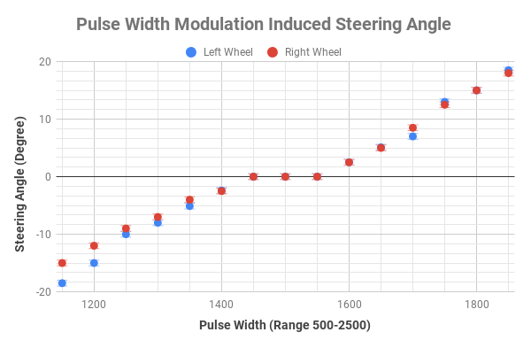
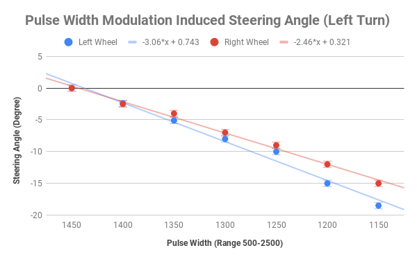
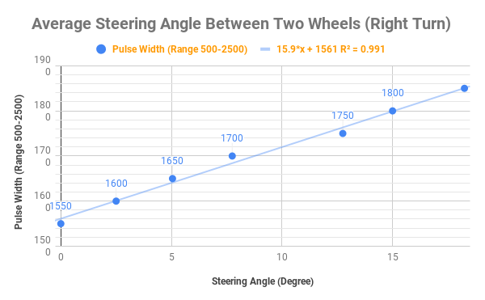

# Servo Experiment

The [GPIO library](http://abyz.me.uk/rpi/pigpio/python.html#set_servo_pulsewidth) provides the `set_servo_pulsewidth` method to control the width of a pulse signal within the range of `[500-2500]`. We conducted an experiment to measure the steering angle of the servo induced from this pulse width range:

## Objective:

- Determine the relationship between pulse width and the induced steering angle on a servo

## Materials
1. Protractor
1. Ruler
1. 8.5"x11" Printing Paper
1. Pencil
1. Car Prototype

## Setup:
1. Make sure the hardware connection is established between a GPIO pin and the servo
2. Place the car prototype on a standard 8.5"x11" printing paper
3. Place the servo on a neutral position and align a ruler with the axis of the wheel (simply place the protractor on the face of the wheel).
4. Draw the line along the ruler
5. Call `set_servo_pulsewidth(GPIO_PIN, PULSE_WIDTH)` where `GPIO_PIN` is the pin connected to the servo and select `PULSE_WIDTH` from the range `[500-2500]`.
6. Align the ruler with the axis of the wheels and mark the position of the two wheels after turn
7. Measure the steering angle with a protractor.
8. Repeat Step 5-8 for each desired pulse width.

## Result

There is linear relationship between pulse width and the induced steering angle.

- Left Turn (width: 1200 - 1450): `17.9x + 1439`
- Right Turn (width: 1550 - 1800): `15.9x + 1561`

